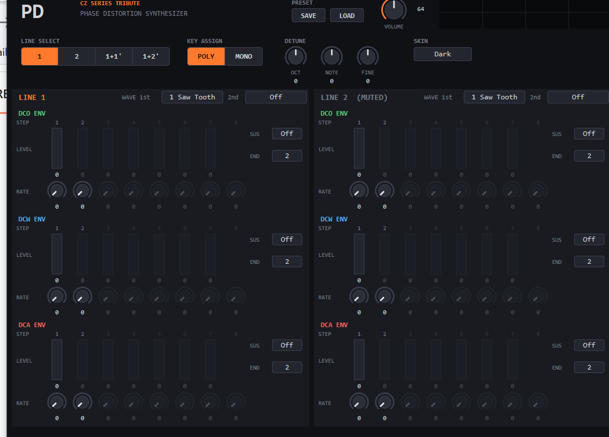
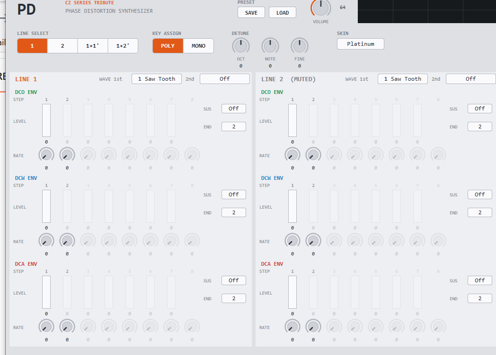
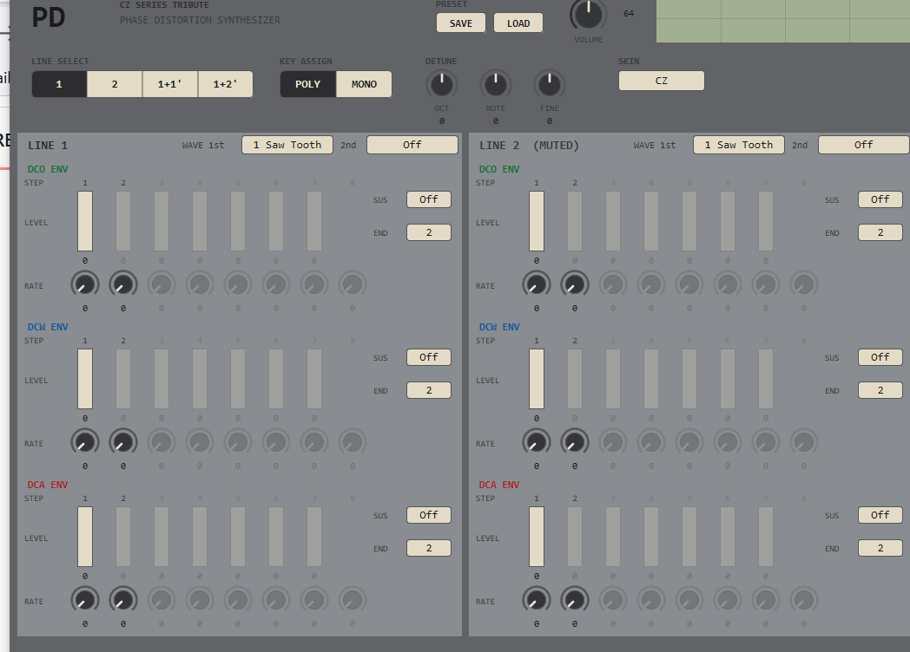

# PD — Phase Distortion Synthesizer (VST3)

カシオ計算機のCZシリーズ (CZ-101 / CZ-1000 / CZ-1 など) に搭載された
**PD (Phase Distortion) 音源**をVST3インストゥルメントとして再現するプロジェクトです。



<details>
<summary>スキンバリエーション (Platinum / CZ)</summary>




</details>

PD音源は、単一のcos波の位相の進み方 (読み出し角速度) を周期の途中で歪ませることで
倍音を得る方式です。フィルタを持たずに「フィルタが開く」ような音色変化を作れるのが
特徴で、本プラグインではこの位相歪みの深さをDCWエンベロープで時間的に制御します。

## 特徴

- **8種類の波形** — Saw Tooth / Square / Pulse / Double Sine / Saw Pulse /
  Resonance I (Saw Tooth) / Resonance II (Triangle) / Resonance III (Trapezoid)
- **DCO第2波形** — 各ラインでFIRST/SECONDの2波形を選択可能。実機同様、
  オシレータの1周期ごとに2波形を交互に出力し、周期が2倍になることで
  1オクターブ下のサブハーモニクスを含む複雑な音色が得られます (SECONDはOff可)
- **LINE SELECT** — `1` / `2` / `1+1'` / `1+2'` の4モード。各ラインは独立した
  波形選択とDCO/DCW/DCAエンベロープ一式を持ちます。`'` (プライム) の付いた
  ラインにはDETUNEが適用されます
- **DETUNE** — Octave (±3) / Note (±11半音) / Fine (±60、1step = 1/60半音) の
  組合せで最大±4オクターブ
- **8ステップ・エンベロープ (EG)** — DCO (ピッチ) / DCW (位相歪み=音色) /
  DCA (音量) それぞれにRate×8 + Level×7 + Sustain Point + End Pointを装備
- **16音ポリフォニック** — デュアルラインモード (`1+1'` / `1+2'`) では実機同様
  8音に半減。ボイス不足時は最古発音を奪って発音します (voice stealing)
- **MONO/POLY** — 実機のSOLOスイッチ相当。MONO時は最終押鍵優先で、
  発音中のキーを離すと保持中の直近キーへ復帰します
- **ステート保存/ロード** — 全パラメータをDAWプロジェクトに保存・復元
- **GUI** — 全パラメータを1画面に収めたエディタ。EGはLevel縦スライダ+
  Rateダイアルの2段構成で列がステップに対応し、全コントロールに数値
  リードアウト付き (クリックして直接入力も可能)。Sustainステップは
  ▲マーカーで表示、End Point以降のステップは自動的にディム表示・操作
  無効化。LINE SELECTで鳴らないラインのパネルには (MUTED) が表示されます
- **プリセット** — GUIのSAVE/LOADボタンから標準の`.vstpreset`形式で
  保存/読込 (DAWのプリセット機構とも互換)
- **オシロスコープ** — ヘッダに出力波形をリアルタイム表示
  (立ち上がりエッジトリガ+振幅自動スケーリング)
- **スキン** — Dark / Platinum / CZ (CZ-101実機のメタリックグレー+
  ベージュキー+LCDグリーンを再現) の3種を切替可能 (選択はプラグインの
  UI設定として保存されます)

## 信号の流れ

```
        ┌─────────────┐   ┌─────────────┐   ┌─────────────┐
        │   DCO EG    │   │   DCW EG    │   │   DCA EG    │
        │  (pitch)    │   │  (timbre)   │   │   (amp)     │
        └──────┬──────┘   └──────┬──────┘   └──────┬──────┘
               ▼                 ▼                 ▼
  note ──► oscillator ──► phase distortion ──► amplifier ──► out
           (waveform 1st/2nd 交互出力)
```

`1+1'` / `1+2'` では上記のライン2系統がスタックされ、プライム側の
ピッチにDETUNEが加算されます。

## パラメータ

| パラメータ | 範囲 | 説明 |
|---|---|---|
| volume | 0–1 | マスターボリューム |
| Line Select | 1 / 2 / 1+1' / 1+2' | ライン構成の選択 |
| Mono/Poly | Poly / Mono | 発音モード (Mono = 最終押鍵優先) |
| Detune Octave / Note / Fine | ±3 / ±11 / ±60 | プライム側ラインのデチューン |
| L1/L2 Waveform 1st | 8波形 | 各ラインの第1波形 |
| L1/L2 Waveform 2nd | Off + 8波形 | 各ラインの第2波形 (1周期ごとに交互出力) |
| L1/L2 {DCO, DCW, DCA} EG Rate 1–8 | 0–99 | 各ステップの変化速度 |
| L1/L2 {DCO, DCW, DCA} EG Lvl 1–7 | 0–99 | 各ステップの到達レベル |
| L1/L2 {DCO, DCW, DCA} EG Sustain Point | Off / 1–7 | キーオン中に保持するステップ |
| L1/L2 {DCO, DCW, DCA} EG End Point | 2–8 | エンベロープの最終ステップ |

- DCW EGのレベルが位相歪みの深さ (=音色の明るさ) を決めます。0で純粋なcos波、
  最大で各波形の特性が最も強く現れます。
- End Pointに指定したステップの到達レベルは常に0です (このためLevelパラメータは
  ステップ数より1つ少ない7個です)。

## MIDIインプリメンテーション

### ピッチベンド・ボリューム (全チャンネル共通)

| メッセージ | 割り当て |
|---|---|
| Pitch Bend | ピッチベンド (±2半音) |
| CC 7 | volume |

### EGパラメータ (チャンネルでラインを選択)

以下のCCブロックが各EGに割り当てられています。CC番号の並びは
パラメータの並び (Rate 1–8, Lvl 1–7, Sustain Point, End Point) と同一です。
CCが**どちらのラインを編集するか**は `CC Edit Line` パラメータで選択します
(実機のパネルで編集対象ラインを選んでから操作するのと同じ考え方)。
GUI編集は左右パネルで編集先が一意なためGUIにスイッチはなく、
**CC 3** (0–63 = Line 1 / 64–127 = Line 2) またはDAWのパラメータ一覧から
切替えます。切替時はホストへCCマッピングの再問い合わせが通知されます。

| 機能 | CC |
|---|---|
| CC Edit Line (編集対象ライン切替) | CC 3 |

| EG | Rate 1–8 | Lvl 1–7 | Sustain Point | End Point |
|---|---|---|---|---|
| DCO EG | CC 14–21 | CC 22–28 | CC 29 | CC 30 |
| DCW EG | CC 46–53 | CC 54–60 | CC 61 | CC 62 |
| DCA EG | CC 102–109 | CC 110–116 | CC 117 | CC 118 |

割り当てには一般的な用途が定義されていないCC (undefined / general purpose) のみを
使用しています。モジュレーションホイール (CC 1)、ペダル類 (CC 64–69)、
サウンドコントローラ (CC 70–79)、RPN/NRPN (CC 6, 38, 96–101)、
チャンネルモードメッセージ (CC 120–127) とは衝突しません。

## ビルド

### 必要環境

- Windows 10 以降
- Visual Studio 2022 (v143 ツールセット、C++17)
- [VST 3 SDK](https://www.steinberg.net/developers/) (vstgui4を含む)

### 手順

1. VST 3 SDKを取得し、SDK側のライブラリ (`base.lib`, `sdk.lib`, `sdk_common.lib`,
   `pluginterfaces.lib`, `vstgui*.lib`) をビルドしておきます。
2. `pd.vcxproj` の以下のパスを自環境のSDK配置に合わせて変更します。
   - `IncludePath`: `<SDKルート>` と `<SDKルート>\vstgui4`
   - `LibraryPath`: SDKライブラリの出力ディレクトリ
3. Visual Studioで `pd.sln` を開き、`Release | x64` でビルドします。
4. 生成された `x64\Release\pd.vst3` を `C:\Program Files\Common Files\VST3\`
   にコピーすると、VST3対応DAWから使用できます。

## ライセンス

[MIT License](LICENSE)
