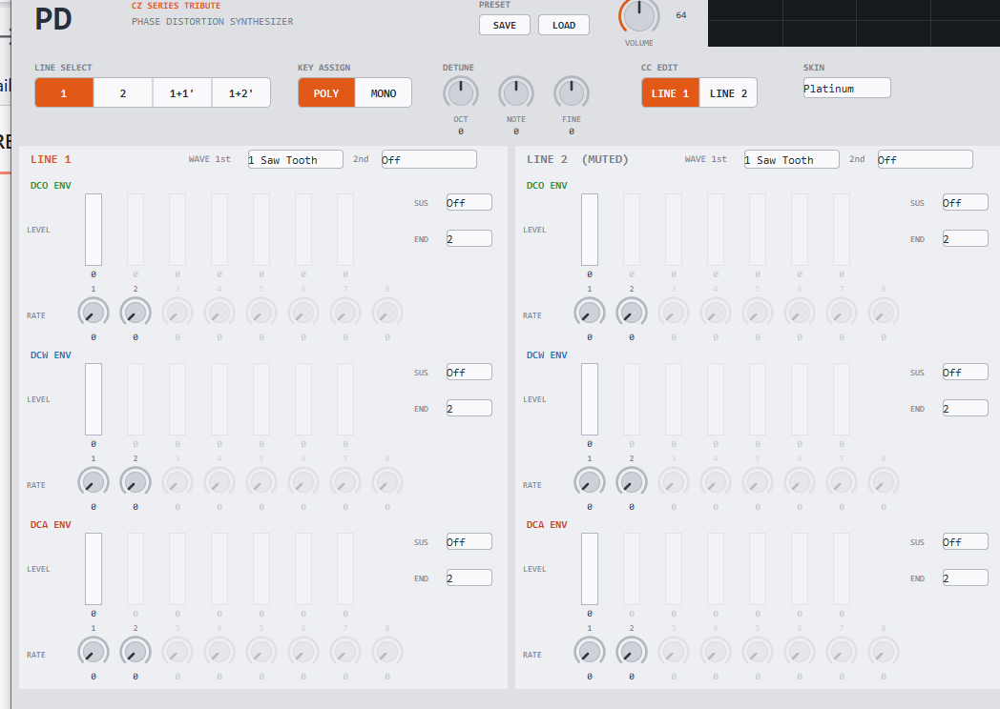
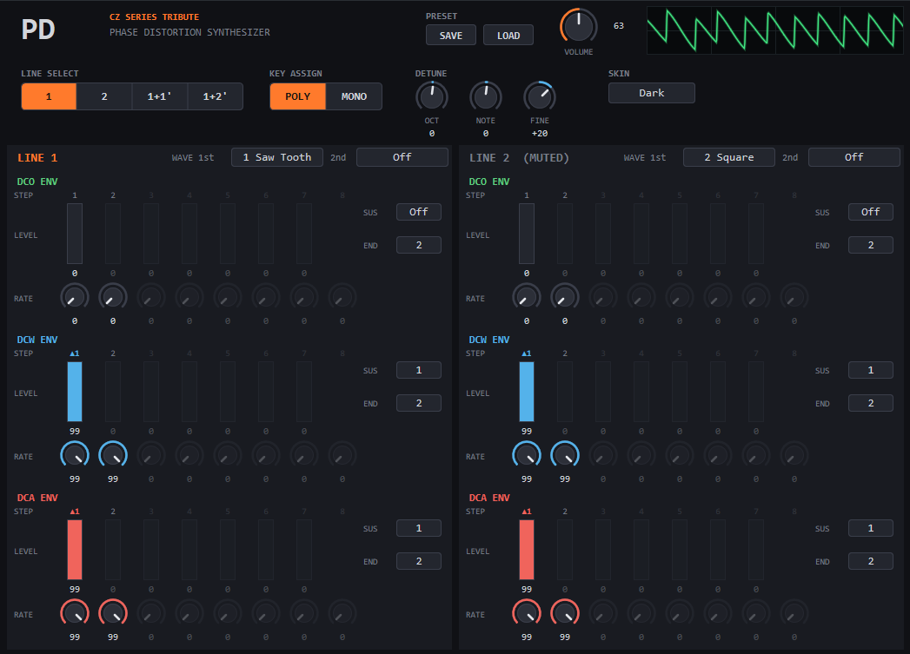
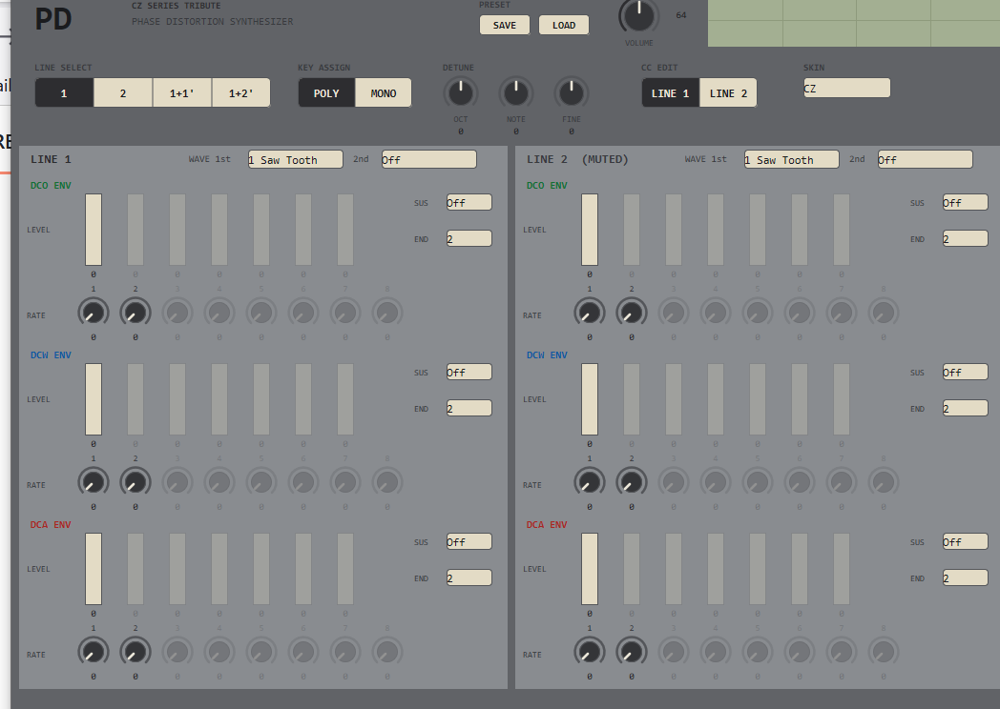

# PD — Phase Distortion Synthesizer (VST3)

カシオ計算機のCZシリーズに搭載されたPD (Phase Distortion) 音源をVST3として再現。
PD音源では、単一のcos波の位相の読み出しを歪ませることで音色を変容させる。



<details>
<summary>Skin Variations (Dark / CZ)</summary>




</details>


## Features
- **8種類の波形** — Saw Tooth / Square / Pulse / Double Sine / Saw Pulse /
  Resonance I (Saw Tooth) / Resonance II (Triangle) / Resonance III (Trapezoid)
- **DCO第2波形** — 各LINEでFirst/Secondの2波形を選択可能（Secondは任意）。実機同様、
  オシレータの1周期ごとに2波形を交互に出力し、周期が2倍になることで
  1オクターブ下のサブハーモニクスを含む複雑な音色が得られる。
- **LINE SELECT** — `1` / `2` / `1+1'` / `1+2'` の4モード。各LINEは独立した
  波形選択とDCO/DCW/DCA Envelopeを持つ。
  `'` (Prime) の付いたLINEにはdetuneが適用される。
- **DETUNE** — Octave (±3) / Note (±11半音) / Fine（±60、1step = 1/60半音）
- **8 Step Envelope (EG)** — DCO（音程）/ DCW（音色）/ DCA（音量）それぞれが
  Rate×8, Level×7, Sustain Point, End Pointを持つ。
- **16 Polyphonic** — dual line（`1+1'` / `1+2'`）では実機同様8音に半減。
  voice枯渇時は最も古いvoiceを奪って発音する。
- **MONO/POLY** — 実機のSOLOスイッチ相当。
  MONO有効時は最終押鍵優先で、発音中の鍵を離すと保持中の直近の鍵へ復帰する。
- **Preset** — GUIのSAVE/LOADボタンから標準の`.vstpreset`形式で保存/読込可能。
- **Oscilloscope** — GUI内に出力波形をリアルタイム表示。
- **Skin** — Dark / Platinum / CZ の3種を切替可能。


## Signal Flow
```
        ┌─────────────┐   ┌─────────────┐   ┌─────────────┐
        │   DCO EG    │   │   DCW EG    │   │   DCA EG    │
        │   (pitch)   │   │  (timbre)   │   │    (amp)    │
        └──────┬──────┘   └──────┬──────┘   └──────┬──────┘
               ▼                 ▼                 ▼
  note ──► oscillator ──► phase distortion ──► amplifier ──► out
           (waveform 1st/2nd 交互出力)
```
`1+1'` / `1+2'` では上記のLINE2系統が加算され、Prime側の音程にdetuneが加算される。


## Parameters
| パラメータ | 範囲 | 説明 |
|---|---|---|
| Volume | [0, 1] | master volume |
| Line Select | {1, 2, 1+1', 1+2'} | LINE構成の選択 |
| Mono/Poly | Poly / Mono | 発音モード |
| Detune Octave / Note / Fine | ±3 / ±11 / ±60 | Prime側のLINE（`1'`, `2'`）のdetune |
| L1/L2 Waveform 1st | 8波形 | 各LINEの第1波形 |
| L1/L2 Waveform 2nd | {8波形, Off} | 各LINEの第2波形（optional）|
| L1/L2 {DCO, DCW, DCA} EG Rate 1–8 | {0..99} | 各stepの遷移速度 |
| L1/L2 {DCO, DCW, DCA} EG Lvl 1–7 | {0..99} | 各stepの到達level |
| L1/L2 {DCO, DCW, DCA} EG Sustain Point | {1..7, Off} | envelopeのsustain step（optional） |
| L1/L2 {DCO, DCW, DCA} EG End Point | {2..8} | envelopeの最終step |

- DCW EGのlevelが位相歪みの深さを決定する。0で純粋なcos波、99で各波形の特性が最も強く現れる。
- End Pointに指定したstepの到達levelは常に0となる


## MIDI Implementation

### Pitch Bend, Volueme（全channel共通）
| メッセージ | 割り当て |
|---|---|
| Pitch Bend | Pitch Bend（±2半音）|
| CC 7 | [param] Volume |
| CC 126 | mono mode ([param] Mono/Poly) |
| CC 127 | poly mode ([param] Mono/Poly) |

### EG Parameters
以下のCCが各パラメータに割り当てられている。
CC番号の並びはパラメータの並び (Rate 1–8, Lvl 1–7, Sustain Point, End Point) と同一。
CCがどちらのLINEを編集するかは`CC Edit Line`パラメータで選択する。

| 機能 | CC | 説明 |
|---|---|---|
| CC Edit Line | CC 3 | 0..63: LINE1, 64..127: LINE2 |
| Line Select | CC 9 | [param] Line Select |
| Wavefome 1 | CC 89 | [param] L1/L2 Waveform 1st |
| Waveform 2 | CC 90 | [param] L1/L2 Waveform 2nd |

| Target EG | Rate 1..8 | Lvl 1..7 | Sustain Point | End Point |
|---|---|---|---|---|
| DCO | CC 14..21 | CC 22..28 | CC 29 | CC 30 |
| DCW | CC 46..53 | CC 54..60 | CC 61 | CC 62 |
| DCA | CC 102..109 | CC 110..116 | CC 117 | CC 118 |

割り当てには一般的な用途が定義されていないCC (undefined / general purpose) のみを使用。
モジュレーションホイール (CC 1)、ペダル類 (CC 64..69)、
サウンドコントローラ (CC 70..79)、RPN/NRPN (CC 6, 38, 96..101)、
チャンネルモードメッセージ (CC 120..127) とは衝突しない。


## Build

### Environment
- Windows 11
- Visual Studio 2026（C++17）
- [CMake](https://cmake.org/) 4.4.0
- [VST 3 SDK](https://www.steinberg.net/developers/)

### Directory Layout
このプロジェクトは、VST3SDKが以下の相対パスに配置されていることを前提としています。
配置場所が異なる場合は`CMakeLists.txt`内の`vst3sdk_SOURCE_DIR`変更してください。

```
Prog/
├── Libs/
│   └── VST_SDK/
│       └── vst3sdk/
└── pd/                  <- 本リポジトリ
    ├── CMakeLists.txt
    ├── build/
    └── ...
```

### Procedure
1. VST3SDKを取得し、上記のディレクトリ構成に配置する。
2. ビルド用ディレクトリを作成し、CMakeでVisual Studioのソリューションを生成する。

```bash
   mkdir build
   cd build
   cmake -G "Visual Studio 18 2026" -A x64 ..
```

※ `build`ディレクトリ内で実行すること（in-sourceビルドは不可）。

※ Generatorはインストール済みのVisual Studioバージョンに合わせて変更可能（`cmake --help`で一覧を確認できる）。

3. ビルド

```bash
   cmake --build . --config Debug
   cmake --build . --config Release
```

もしくは、生成された `build/pd.slnx` をVisual Studioで開いてビルドしてもよい。

4. ビルド後、`.vst3`は自動的に`C:\Users\<username>\AppData\Local\Programs\Common\VST3`以下へコピーされる（`smtg_add_vst3plugin`によるデフォルト設定）。

※ DAW側の検索パスにここが含まれていない場合は、DAWの設定でパスを追加するか、`C:\Program Files\Common Files\VST3\`に手動でコピーする。

### Debug (Attach to Process)
1. `build/pd.sln` をVisual Studioで開く。
2. DAW（またはVSTHost等のテストホスト）でプラグインをロードする。
3. Visual Studio -> デバッグ -> プロセスにアタッチ -> 対象のDAWプロセスを選択。
4. 適当な箇所にブレークポイントを設定し実行。

### Notes
- `build/`はCMakeの生成物であり、`CMakeLists.txt`から再生成可能なためバージョン管理対象外。
- GUIは [VSTGUI](https://github.com/steinbergmedia/vstgui) を使用しており、`CMakeLists.txt`内で `SMTG_ENABLE_VSTGUI_SUPPORT` を有効化してビルドしている。


## License
[MIT License](LICENSE)
